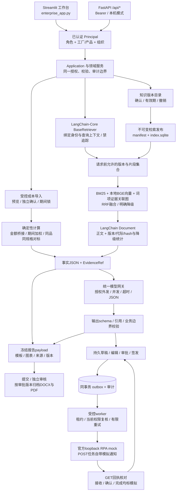
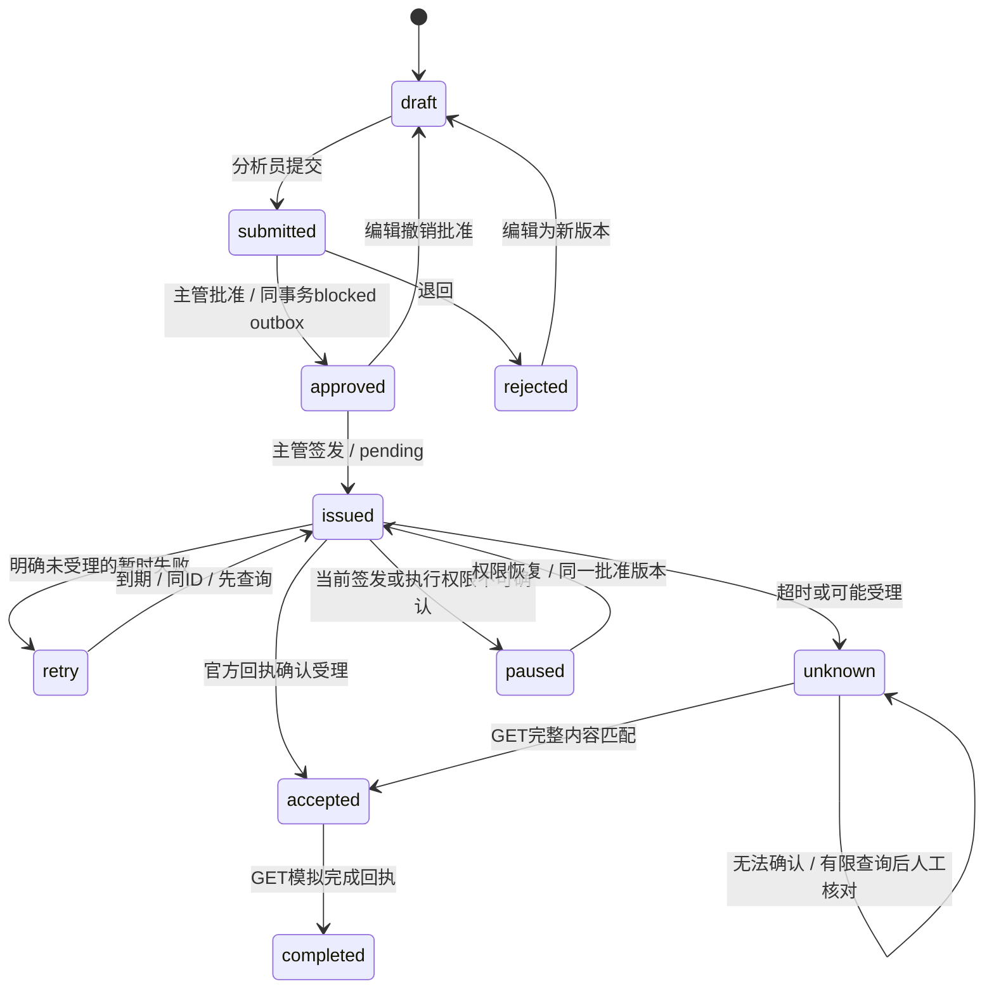

# 制药企业产品成本智能分析系统：技术方案与接口

本文对应当前 `project4` 代码，实现入口为 [enterprise_app.py](../enterprise_app.py) 与 [backend_api.py](../backend_api.py)。适用范围是单组织、单实例管理会计辅助分析。API版本为 `2.0.0`；角色、数据范围、证据版本、报告审批和任务签发由统一应用及领域服务约束。文档描述代码合同，不把代码存在等同于真实模型、生产OIDC、浏览器或Docker环境已经验收。

配套阅读：[数据字典与交付边界](数据字典与交付边界.md)、[部署与运维手册](部署与运维手册.md)、[Prompt与模型评测协议](Prompt与模型评测协议.md)、[用户操作手册](用户操作手册.md)。赛题原件摘要与已执行数值检查见内部受控文件 [competition_data_inventory.json](../delivery/competition_data_inventory.json) 和 [验收矩阵](../delivery/赛题数据与功能验收矩阵.md)。inventory含原文和明细，不随公开代码/PPT外传；公开材料仅引用文件名、摘要、汇总结果和证据边界。

## 1. 结构与数据流



这是模块化单体与独立作业进程的组合。核心安装采用 `requirements.txt`；可选本地BGE依赖在 `requirements-models.txt`，旧实验依赖另列。正式知识PDF解析采用pypdf，不能把旧环境安装的PyMuPDF/Chroma/torch写成核心运行的必选依赖。UI不必绕道HTTP：Streamlit通过 `Application(principal)` 和接收 `Principal` 的领域服务调用，FastAPI也调用同一边界。认证/授权拒绝不会触发无权限的本地查询回退。程序计算、受控检索、模型解释、批准和外部副作用分别保存可追溯结果。

| 层 | 当前实现 | 主要职责 |
|---|---|---|
| 工作台 | `enterprise_app.py`、`app_pages/`、`dashboard_web.py`、`report_web.py` | 角色导航、业务表单、ECharts、下载及状态展示 |
| HTTP | `backend_api.py` | 严格请求模型、认证中间件、request_id、统一异常响应 |
| 应用与身份 | `enterprise/application.py`、`enterprise/security.py` | 数据范围、业务动作授权、服务器主体映射 |
| 成本与期间 | `enterprise/cost_imports.py`、`enterprise/periods.py`、`dashboard/validate.py` | 原件、修订、勾稽、并发确认、关账/重开 |
| 知识 | `enterprise/knowledge.py`、`enterprise/knowledge_release.py`、`enterprise/knowledge_langchain.py` | 版本、统一发布、预授权引擎与LangChain-Core BaseRetriever/Document适配 |
| 分析 | `attribution_*`、`enterprise/benchmark.py`、`enterprise/benchmark_ai.py` | 数值事实、金额与结构分解、受控模型解释 |
| 报告 | `report/registry.py`、`report/model.py`、`report/export.py`、`enterprise/report_records.py` | 模板注册、固定payload、DOCX/PDF与审批归档 |
| 任务 | `enterprise/task_workflow.py`、`enterprise/rpa_client.py`、`enterprise/task_worker.py` | 版本审批、outbox、发送安全、回执与恢复 |
| 运维 | `enterprise/operations.py`、`scripts/preflight.py`、`scripts/backup_restore.py` | 维护锁、SQLite一致备份、恢复门禁、预检 |

`COST_DATA_DIR` 和 `COST_MANAGED_DIR` 分开配置；SQLite版本库、知识原件、发布索引、报告归档与任务库依靠同一受控根目录维护协议协调。`root`仅选择本机SQLite/文件位置，不表示已提供PostgreSQL、分布式事务或多租户存储抽象。

## 2. 数值权威、数据闸门与来源

主键为工厂、产品、规格、月份；材料追加原料名，制费追加费用类别。CSV/XLSX先预览、分类、校验、显示差异；确认时验证预览基线hash、审批身份和期间状态，再把修订与审计写入事务。企业模式由另一位主管确认；本机OS全角色演示明确标为模拟审批。

导入限制包括单文件20 MiB、单表100000行、有限非负数、最多6位小数及合同数值上限。读取端五层检查为完整性、准确性、勾稽、隔离、边界；前置结构错误阻止后续算术。各年/各厂汇总、预算和所提供明细均须校验。缺失对照期或可选数据列为明确不可用/警告；已提供但矛盾的数据属于阻断错误。

| 数值合同 | 计算或约束 |
|---|---|
| 三要素单位成本 | 材料＋人工＋制造费用，与单位成本差不超过0.005元/盒 |
| 金额闭合 | 单位成本×产量、明细总额与汇总的固定容差为0.01元，不能乘产量放大 |
| 金额贡献度 | 要素金额变动÷总成本金额变动×100%；零分母无定义，允许负贡献 |
| 连续环比 | 只比较连续上月；缺月不以最近可用月替代 |
| 季度单位成本 | 完整期总金额÷完整期总产量，不平均月度单位成本 |
| 跨厂差异 | 同品、同规格、同期；一厂减二厂，差率以二厂为基准 |
| 标准化金额 | 单位差×选定产量是比较测算，不能写成已经实现的节约 |
| 行情与材料 | 元/盒单位消耗成本、元/kg或元/万粒市场价是不同量；市场参考不是实际成交凭证 |

内部来源包含文件、完整SHA256、工作表、导入记录序号及业务键。`_source_row/record_number`不是所有CSV的物理行号；知识正文偏移、切片序号、实际可得页码各有语义。数字通过独立复算仍需核实输入会计口径；模型不会替代账实审核。

## 3. 正式RAG检索的真实实现

正式分析/归因与报告证据使用 [enterprise/knowledge_langchain.py](../enterprise/knowledge_langchain.py) 的 `ControlledKnowledgeRetriever`，它继承 `langchain-core==1.6.2` 的真实 `BaseRetriever`；`knowledge_context.context()`与`analysis_service.report_evidence()`经`retrieve_rows()`调用`invoke()`并取得实际`Document`。适配器每次调用 `enterprise.knowledge_release.get_search_engine()`返回的受控引擎，保留授权与发布校验；持久化仍为SQLite manifest/索引，没有另建Chroma库。搜索API直接调用同一受控引擎，其安全边界相同，但不据此声称该API额外经过BaseRetriever。旧 `kb_search.py`和图谱工具不在公开核心包内，不能据历史兼容代码声称正式链路已经运行工艺专家图或重排。

1. PDF、DOCX、TXT等原件经过解析、预览、业务范围/有效期填写、确认，形成不可变知识版本。同正文的适用范围、日期等metadata变化仍可成为新业务版本。
2. 发布收集版本集合，构建 `knowledge_releases/<release_id>/index.sqlite`，验证manifest、字节hash与代际后切换活动指针。构建失败不发布半成品；“已确认文档”和“可检索发布”是不同状态。
3. 默认切片是**900字符窗口、150字符重叠**。字符偏移和序号为确定定位；跨页片段的 `page_hint`只是页码提示。
4. 本地BGE-M3使用CPU fp32、CLS dense、L2归一化、`local_files_only=True`和 `trust_remote_code=False`。**1024是编码输入token上限，不是切片字符数，也不是代码硬编码的向量维数**；最新实现 `truncation=False`，超限明确拒绝，要求缩小分块再发布，不悄悄截断正文。向量维度取实际模型输出并校验一致。
5. 词法采用中文重叠双字词及ASCII词的分词器，BM25参数对应 `k1=1.5,b=0.75`。关联图是词项—证据片段二部图，做两跳受控扩展；边表示词项共现，不能解释成产品配方、工序因果或人工确认的专家关系。
6. 所有候选生成器先使用同一组织、当前Principal、产品/工厂、业务有效日、`known_at`、已发布版本与撤销集合。未知范围和模拟案例不自动成为公共资料；输出前再次检查知识撤销。
7. 三路用 `1/(60+rank+1)` 的RRF融合。当前正式发布的reranker明确为 `disabled`，输出 `reranked=false`；不使用未经标定的统一重排阈值保证拒答。

LangChain适配器在服务端按请求绑定Principal、产品/工厂、`as_of/known_at/release_id`与允许范围，调用者不能用Runnable配置覆盖身份或注入回调。每次`invoke/ainvoke/batch/stream`重新执行受控检索，不复用以前返回的Document作为授权结果。Document保留真实chunk正文和document/version/chunk/release/generation/hash、范围、路由分数与降级原因；元数据秘密字段会剔除。独立上下文、显式空CallbackManager和`tracing_context(enabled=False)`共同关闭环境继承追踪；核心依赖同时固定`langsmith==0.12.2`，适配器不会自动向LangSmith外传业务证据。

实际干净环境的框架类型、Document正文、正式context调用、同实例撤销复验及环境追踪打开时零网络尝试，见内部受控 [langchain_adapter_clean_verification.json](../.artifacts/langchain_adapter_clean_verification.json)。该记录使用合成知识，不替代真实BGE或真实模型效果验收；原记录不随公开源码包分发。

统计字段 `release_id/authorized_version_ids/route_generations/vector_n/bm25_n/graph_n/fused_n/retrieval_mode/degraded/degradation_reasons/no_answer/reason`及`framework.{name,version,retriever,tracing,callbacks}`是运行证据。无本地模型、模型加载中、指纹不符或编码超时可退到 `bm25_graph_fallback`；没有发布、无授权有效版本、无匹配证据会返回空结果及原因。词法降级成功不得记为向量检索通过。正相似度和RRF排名也不是经过校准的相关性置信度。

`analysis_service.report_evidence()`固定本次检索release与known_at，逐月查询并保留真实月份覆盖。`context_only`资料不充当当期原因依据；证据输出保留source/version/chunk/release/hash、已知冲突和限制。文档机制解释不证明当期实际经营事件发生。

## 4. 模型与报告冻结

统一网关 [enterprise/model_gateway.py](../enterprise/model_gateway.py) 使用OpenAI兼容JSON响应、服务器配置、外部HTTPS与批准外发标记、有限超时、禁止自动SDK重试及最多两路模型并发。模型密钥不进入业务记录。具体prompt、schema和路径差异见评测协议；不能将所有模块的不同校验器描述为同一个强语义保证。

单品归因（M2）使用`M2_INSTRUCTION`，当前提示版本`attribution-hypotheses/1.3`，输出三个要素各自的`hypothesis/recommendation/evidence_ids`。首次对象回复业务校验失败时，默认模型worker仅在同一45秒总预算和剩余时间条件下允许一次校验反馈修订，不能因认证/网络/网关JSON失败重试；父进程再次校验候选。`model_run.attempts`分别保留初次与修订的状态、指令/输入/回复hash、诊断、耗时与采用标记，修订合格不抹去首败。测试注入回调单次执行，不替代正式可终止worker的运行证据。合成PID测试检查执行前实际进程存活与超时回收后的退出；Windows和Linux覆盖范围以各自记录为准。网关将None/空白/非文本响应作为协议失败，不补成空对象触发修订。

跨厂提示`benchmark-hypotheses/1.1`与单厂期间提示`report-hypotheses/1.1`共享五字段解释schema，再各自追加范围；期间报告不再复用跨厂专属提示全文。解释正文不复述日期、数值或内联证据ID，真正的数字和字段由程序计算。建议须有责任主体和核查动作，仍需要人工合理性审核。三场景四模块的12条结果与实际请求尝试数分别统计，不能把带修订的模块调用说成一次HTTP请求。

[report/registry.py](../report/registry.py)解析正文、嵌套表格和页眉页脚中的 `{{占位符}}`。`report/model.py`将事实、全文解释、证据清单、模板原字节、图表、输入与模型/提示词/计算/渲染版本冻结为可校验JSON，建立统一block模型。正式报告要求所选期间汇总及经营明细完整；资料不足可生成标明缺口的核查稿。

当前输出固定六个业务章节：封面与基本信息、总成本概览、成本要素明细分析、重点产品专项分析、对标分析（与中药二厂）、总结与建议。报告模型调用解释的是单厂期间事实；`include_benchmark=true`加入对标表、结构和限制文本，不证明已经运行跨厂AI拆原因。该能力需单独执行 `enterprise.benchmark_ai.generate_benchmark_analysis()`或 `/api/benchmark`并验收。DOCX使用模板、真实表格及嵌图；PDF由ReportLab与可嵌入中文字体直接生成，两者读取同一冻结payload，不在导出时重读最新源数据或再次调用模型。

报告状态 `draft → submitted → approved/rejected`，审批状态版本单独递增。企业模式创建人不得自批，审核意见必填，非正式核查稿不能批准成正式报告。冻结内容本身不在原ID下改写；需要新分析时创建新报告记录。导出允许草稿，但明显标示“草稿／未签发”；批准后标示报告ID、审批版本、审核人/时间/意见。每种格式按报告ID＋格式＋审批版本保存原字节和hash，历史导出先校验再复用。知识访问撤销也会阻断含该证据正文的报告读取/导出。内容hash与审批记录不等同法定电子签名。

## 5. 任务闭环与作业安全

任务业务内容为 `task_title/assignee/source/priority/deadline/suggestion/factories/evidence_ids/analysis_run_id`。结构任务可来自模型或人工；模型故障/缺配置/输出不符时明确 `rule_fallback`，不会冒充AI成功。草稿可待分配责任人，但提交起姓名、部门、日期必填；岗位可选。跨厂分析映射为官方“专题分析”，中文优先级转换为 `high/medium/low`，截止日期为 `YYYY-MM-DD`。



这是业务与派发状态的合并示意；数据库分别保存 `workflow_status`、`dispatch_status`、`receipt_status`。编辑未签发版本会产生新版本并清空当前批准；已签发任务不可编辑。企业创建者及当前版本编辑者均不能批准自身工作；本机OS模式允许演示用模拟审批。

批准内容、唯一outbox事件和审计同事务提交；签发才将 `blocked`变为可派发。领取采用SQLite事务、`lease_token/lease_until`和旧worker隔离。每次POST之前按固定 `task_id` GET，匹配完整已批准内容；GET之后再次解析执行者与原签发人的当前服务器权限，撤权转 `paused`。重复点击不会换ID、复制事件或重置次数。

连接失败/限流等明确未受理错误使用有限退避；POST可能已受理、5xx、超时或worker崩溃后转 `unknown`，只做有限GET核对。官方mock只有内存去重，404可能意味着服务重启丢失记录，因此不能据此自动POST第二次。查询耗尽后等待人工核对；手动 `sync`也只查询。已受理记录不会因远端404而重发。

`POST /api/rpa/tasks`自身产生一次模拟微信通知，本客户端没有额外notify步骤。客户端只允许官方8090端口的loopback origin，localhost固定为127.0.0.1，禁环境代理及重定向，不跟踪远端 `tracking_url`。生产配置即使提供allowlist也禁止实际I/O。`sent/received/confirmed/in_progress/completed/overdue`都是模拟服务回执；`accepted`或outbox的 `delivered`不代表真实微信送达或实际整改完成。

`TaskWorker.run_once()`周期刷新服务身份、执行有限批次派发并同步已受理未完成任务。未知结果不会借自动回执轮询绕过查询上限。`scripts/run_task_worker.py --once`可单轮运行；常驻轮询间隔0.1–5秒。OIDC worker须显式 `COST_WORKER_SUBJECT`；本机模式使用服务器OS主体。维护锁覆盖完整网络派发与落库；恢复门禁阻止POST，但允许只读GET核对。

## 6. 身份与授权合同

`Principal(user_id, display_name, roles, factories, products, tenant_id, auth_method)`必须由服务器认证流程提供，业务JSON不得传入actor、角色或租户来获取权限。

- 本机 `local` 模式仅loopback、单OS用户、全角色演示；拒绝代理转发身份。它不证明企业SSO已经完成。
- OIDC UI使用 `st.login/st.user`，API使用Bearer JWT并校验issuer/audience/JWKS/过期等。稳定主体为签发者＋subject；角色、工厂、产品从服务端授权JSON映射，显示名不是身份依据。
- 空范围没有对应范围权限；`*`只在服务器明确授予时表示全域。当前部署只支持配置的单组织，不能据 `tenant_id`字段宣称多租户产品。
- 权限撤回在后续请求/worker轮次重读配置，任务POST前额外重验两个主体。身份文件更新、会话注销、真实IdP与反向代理行为仍须目标环境验收。

| 角色 | 当前主要动作 |
|---|---|
| analyst | `data.read/stage`、`dashboard.read`、`knowledge.read`、`analysis.generate`、`report.generate/read`、`task.create/read` |
| supervisor | 分析员动作及 `data.confirm/period.manage/knowledge.publish/report.approve/task.approve/task.send/task.audit/audit.read` |
| knowledge_admin | `knowledge.read/stage/publish/audit` |
| auditor | 已授权业务数据、看板、知识、报告、任务读取，以及 `task.audit/audit.read` |
| system_admin | `system.read/backup/configure`；不隐含业务数据权限 |

## 7. HTTP API合同

以 [backend_api.py](../backend_api.py) 为路由事实来源，运行实例的 `/openapi.json`为参数机器规范。成功响应通常为HTTP200；创建操作当前也返回200。除健康与文档路由外先认证。所有响应由中间件添加 `X-Request-ID`与 `Cache-Control: no-store`；启用CORS需服务器显式配置允许origin。

### 7.1 实际异常与响应语义

| HTTP码 | 当前触发 | 调用方处理 |
|---|---|---|
| 200 | 请求处理成功或返回显式降级/失败状态对象 | 必须继续检查 `generation_status/generation.mode/dispatch_status/no_answer`等业务字段 |
| 401 | `AuthenticationError`、缺少/失效登录主体 | 重新认证，不回退无权限本地路径 |
| 403 | 已识别主体缺角色、工厂/产品/组织权限、自批被拒 | 阻断操作，联系授权管理员 |
| 404 | `TaskNotFound`或路由显式 `HTTPException(404)`，例如产品/规格或动作不存在 | 重新检查资源和路径；不泄露跨范围资源 |
| 409 | `TaskConflict`或知识 `VersionConflict` | 刷新当前版本并重新复核，不能覆盖并发变更 |
| 422 | Pydantic字段格式/extra字段错误；普通领域 `ValueError` | 修正参数/资料。报告/期间当前仍以ValueError表达的版本冲突也为422，不泛称全部冲突409 |
| 503 | `MaintenanceError`或其他未处理服务/存储异常 | 维护响应含 `Retry-After: 30`；按request_id核查日志，任务先查持久状态，不盲目重发 |

结构化日志输出request_id、method、规范化route模板、status、duration；不记录原始业务路径、token或prompt。健康接口只表达进程可应答，完整部署就绪性由preflight等独立检查提供。中间件自行构造的错误体含 `detail/request_id`；FastAPI显式HTTPException及请求验证错误使用其标准 `detail`结构，request_id至少可从响应头获得。正式任务发送中的已分类HTTP/传输失败通常保存到任务 `last_error`并以200返回任务状态，不直接透传远端码。

### 7.2 健康、身份与看板

| 方法与路径 | 参数 | 授权及范围 | 主要返回 |
|---|---|---|---|
| `GET /api/health` | 无 | 匿名 | `status/version/source_fingerprint/validation`；代码指纹供launcher拒绝复用旧代码服务，不代表模型、数据或业务链健康 |
| `GET /api/system/status` | 无 | `system.read` | `uptime_seconds/http_status_counts/operations/model.public`，不返回密钥；计数仅当前API进程，重启归零 |
| `GET /api/me` | 无 | 已认证 | 服务器Principal字段 |
| `GET /api/dashboard/products` | 无 | `data.read` | 授权表中的 `products` |
| `GET /api/dashboard/months` | 无 | `data.read` | 授权表中的 `months` |
| `GET /api/dashboard/{product}` | query `specification?` | `dashboard.read`＋`data.read`，中药一厂及product | series、mom、yoy、budget_var、contribution等；显示浮点按2位格式化 |
| `POST /api/dashboard/validate` | 无正文 | `data.read` | `passed/layers/warnings`；Application前置闸门失败可先返回422 |
| `POST /api/attribution` | AttributionParams | `analysis.generate`，一厂/product，另数据与证据读取权限 | 确定性事实、归因、来源、模型/降级状态 |

`AttributionParams = {product: str, month: YYYY-MM, use_llm: bool=true, specification?: str}`，未知字段拒绝。多规格产品未指定规格返回422；无此产品/规格显式404。月份语法合法不代表相应数据存在，实际期间仍由分析服务检查。

### 7.3 知识检索与目录

| 方法与路径 | 参数 | 授权 | 主要返回 |
|---|---|---|---|
| `POST /api/search` | `{query, top_k=5, mode='formal', product?, factory?, as_of=今日, known_at?}` | `knowledge.read`及查询范围 | `query/results/stats`，结果含正文、文档/版本/片段/release、来源和三路分数 |
| `GET /api/kb/collections` | 无 | `knowledge.read` | 单一 `governed_documents`目录及可见文档计数，demo_count=0 |
| `GET /api/kb/chunks` | query `offset=0, limit=50`；limit 1–100 | `knowledge.read` | `total/items`；**当前items是可见知识文档版本记录，虽路径名chunks，也不是索引切片列表** |

HTTP search query 1–2000字符、top_k 1–20，仅 `mode='formal'`；其他mode为422。生效日期与known_at按领域校验。知识上传、确认、发布、撤销当前通过受控UI/领域服务提供，没有对应公开HTTP写路由；不能在接口列表中虚构 `/api/kb/publish`等端点。

### 7.4 报告与审批

`ReportParams`继承AttributionParams，增加 `theme='月度成本分析'`、`formal=true`、`include_benchmark=true`、`focus?:str`、`format='docx'`。主题由报告服务限定月度/季度/专题；季度用传入month定位所属季度。开启二厂对标需二厂数据权限。知识检索需要相应 `knowledge.read`。`format`在导出时校验为docx/pdf。

| 方法与路径 | 输入 | 授权及语义 | 主要返回 |
|---|---|---|---|
| `POST /api/report` | ReportParams | `report.generate`＋数据/证据范围；创建记录并导出 | 文件字节；`X-Report-ID/X-Review-Status`；默认可能为未签发草稿 |
| `POST /api/reports` | ReportParams | 同上；创建冻结报告，不导出文件 | 报告记录，含payload、status、version、hash |
| `GET /api/reports` | 无 | `report.read`及记录工厂/产品/组织 | `{reports:[...]}`元信息 |
| `GET /api/reports/{ident}` | 路径ID | `report.read`，验证冻结hash与当前知识证据访问 | 单个完整记录 |
| `POST /api/reports/{ident}/submit` | Decision | `report.generate`，draft/rejected→submitted | 更新审批版本后的记录 |
| `POST /api/reports/{ident}/approve` | Decision，reason必填 | `report.approve`、企业独立审批、正式资料完整性 | approved记录 |
| `POST /api/reports/{ident}/reject` | Decision，reason必填 | `report.approve`、企业独立审批 | rejected记录 |
| `GET /api/reports/{ident}/export/{format}` | format=docx/pdf | `report.read`及当前证据访问 | 同审批版本归档文件；草稿有清晰标记 |

`Decision = {expected_version: int>=1, reason: str=''}`。报告审批动作校验expected_version。动态路径 `{action}`仅支持submit/approve/reject，其余显式404。导出时MIME为DOCX或PDF，`Content-Disposition`包含报告ID文件名。报告事件查看与重生成操作通过UI/领域服务完成，不存在未列出的HTTP编辑接口。

### 7.5 成本上传与审计

| 方法与路径 | 输入 | 授权 | 主要返回 |
|---|---|---|---|
| `POST /api/upload/cost` | multipart字段 `file`；CSV/XLSX | `data.stage`及所有变更范围 | 预览批次、差异、校验；HTTP返回排除完整 `tables` |
| `POST /api/upload/cost/confirm` | `{stage_id, mode, reason=''}` | `data.confirm`、全部变更范围、企业非自批、期间开放 | 确认修订或重复结果 |
| `GET /api/audit` | 无 | `audit.read`及变更范围 | `{rows:[...]}`成本确认修订头；不是所有模块的审计全集 |

`mode`取领域合同中的“新月份新增”或“历史修订”；历史修订须说明原因。待确认批次列表、期间关账/重开、原件查看当前在受控UI/领域服务，不冒称已开放HTTP路由。

### 7.6 跨厂对标

`POST /api/benchmark`接受AttributionParams且 `specification`必填。需要一厂、二厂及该产品的 `analysis.generate`权限，读取授权表与已发布证据，返回差异事实、结构、解释、建议、证据和生成模式。二厂缺明细时只使用其汇总，一厂原料下钻作为核查线索，禁止摊造二厂原料数值。

### 7.7 任务生成、审批和回执

| 方法与路径 | 输入 | 授权 | 主要返回 |
|---|---|---|---|
| `POST /api/tasks` | `{payload:dict, generate_with_model:false}` | `task.create`及payload工厂/产品 | 持久任务；true才调用受控模型生成 |
| `GET /api/tasks` | 无 | `task.read` | `{tasks:[...]}`，当前API使用仓储默认上限100 |
| `GET /api/tasks/summary` | 无 | `task.read`及逐任务组织/工厂/产品范围 | `generated/accepted/received/confirmed/completed/needs_attention`，`simulated=true`；对所有可见任务累计，不受列表100条限制 |
| `GET /api/tasks/{ident}` | 路径ID | `task.read`、组织及所有任务范围 | 单个任务 |
| `POST /api/tasks/{ident}/edit` | `{changes:dict, expected_version:int>=1}` | `task.create` | 新版本；嵌套source/assignee可合并；旧批准失效 |
| `POST /api/tasks/{ident}/submit` | Decision | `task.create` | submitted |
| `POST /api/tasks/{ident}/approve` | Decision，reason作为comment | `task.approve`、独立作者/编辑者复核 | approved＋blocked outbox |
| `POST /api/tasks/{ident}/reject` | Decision，reason必填 | `task.approve` | rejected，未发送事件取消 |
| `POST /api/tasks/{ident}/enqueue` | Decision | `task.send` | issued＋pending；重复调用不重置 |
| `POST /api/tasks/{ident}/dispatch` | Decision | `task.send`，POST前再验证当前执行者/签发者 | 到期任务处理结果数组，可能 `[]` |
| `POST /api/tasks/{ident}/sync` | Decision | `task.send` | 只GET核对后的单任务记录 |

汇总中 `generated`是已创建任务总数，不是AI调用数；`received`包含其后confirmed/in_progress/completed，`confirmed`包含其后in_progress/completed，`needs_attention`包括unknown/paused/failed或overdue。各计数为模拟业务状态，不能相加为互斥总数或证明真实整改。动态task action只支持以上六个动作，其余显式404。dispatch/sync虽然因当前HTTP路由共用Decision而要求 `expected_version`，领域派发使用持久化当前已批准/签发版本，不把该正文值当成重发或覆盖指令。任务版本、全部回执和审计查询在仓储/UI可用，当前没有另设 `/api/tasks/{id}/events`HTTP端点。

业务示例只演示结构，不包含完整赛题数据：

```json
{
  "payload": {
    "task_title": "核对本期材料差异的原始凭证",
    "assignee": {"name": "已指定责任人", "department": "采购部", "role": "采购岗位"},
    "source": {
      "analysis_type": "月度成本分析",
      "analysis_month": "2026-05",
      "product": "已授权产品名称",
      "finding": "材料差异需结合采购结算与领退料记录核查"
    },
    "priority": "high",
    "deadline": "2026-07-01",
    "suggestion": "提交原始凭证、差异核对表与待补资料清单",
    "factories": ["中药一厂"],
    "evidence_ids": [],
    "analysis_run_id": "本地有效分析运行ID"
  },
  "generate_with_model": false
}
```

`payload`只允许业务字段；actor、租户、状态、生成模式和批准信息不能由请求正文伪造。上述名称及日期须由授权真实业务输入替换，不能直接作为事实样例提交。

### 7.8 自动文档端点

FastAPI自动提供 `GET /openapi.json`、`GET /docs`、`GET /redoc`，当前中间件允许匿名获取接口说明。框架的 `GET /docs/oauth2-redirect`并未在匿名豁免表中；企业业务API仍使用Bearer。接口说明公开不等于业务数据公开。

## 8. 恢复、部署与验收边界

本机启动器 `launch_system.py`启动或复用本机API、启动UI，并默认启动已签发任务worker；`--no-worker`关闭worker，`--with-mock`显式启动官方8090 mock，`--smoke-test`不启动worker。启动器只清理自己创建的子进程。容器 `deploy/entrypoint.py`最新实现一并监管API、UI与任务worker，生产固定OIDC；启动前校验显式 `COST_WORKER_SUBJECT`及其当前发送权限。此代码合同不表示目标容器环境已经运行验收。

维护采用本地OS排他锁与持久维护标记。备份可变SQLite使用SQLite backup API，固定发布索引保持已校验原字节；新目录恢复后建立 `.restore-review-required.json`，核对批准任务与外部回执前禁止派发。恢复不回滚企业权限配置，不自动重新发送。CLI停写声明不证明主机不存在不遵守锁的旧进程，需要运维执行配合。

交付验证分开记录：代码/单元测试、原始数据独立复算、真实本地向量与检索、模型结构化调用、三场景Word/PDF、浏览器流程、官方mock HTTP与回执、真实IdP/容器现场测试、人工合理性评分。测试数从对应提交的JUnit XML统计；MockTransport和ASGI进程内契约不替代真实AI、HTTP服务或生产OIDC验收。实际三场景记录保存在受控`delivery/private/scenarios/<run_id>/assessment.json`，浏览器视频与动作记录位于`delivery/private/demo/<run_id>/`，恢复、干净环境及源码净解压核对各自留证。记录必须绑定输入hash、代码/模型/发布版本及执行时间，重跑保留原失败记录。公开源码CI仅运行白名单合成测试；私有原件、模型结果、视频、评分和运行库不随公开包分发。
